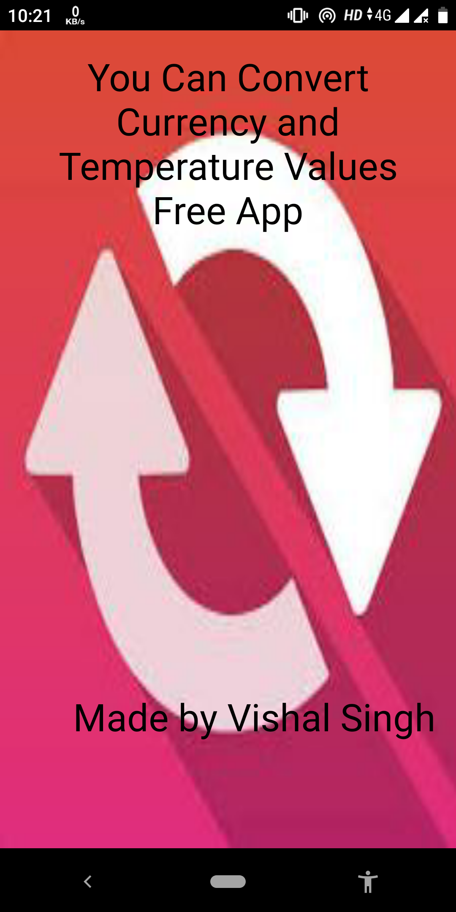
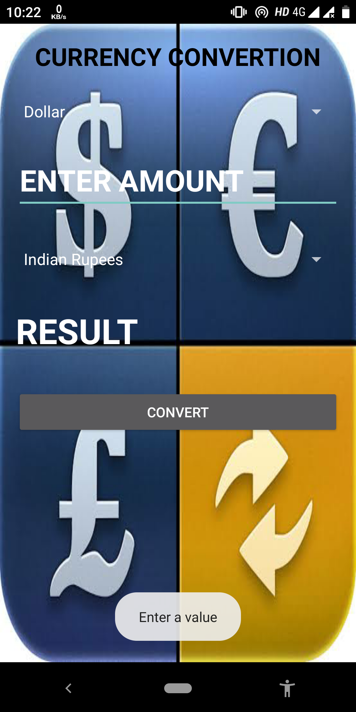

#  Converter

## Features

* Splash screen
* Animation styles
* ImageView
* OnClickListener
* Simplified Theme
* ListView
* Well Constrained Layout

## Platform
        -> Android Studio
        -> With JAVA Support

## Accessing tips :

1. Clone or download the repository: `https://github.com/vishalvs9728/Converter_android_app`
2. Navigate to the folder `app` Folder
3. Navigate to the folder `Converter_android_app/app/src/` to access developers content
3. Navigate to the folder `APK` for users to access apk
4. Copy the apk from folder `APK` to an android phone
5. Install the apk

The app is finally installed on your Android mobile device !!

To directly download the apk [Click Here](https://github.com/vishalvs9728/Converter_android_app/APK/Converter.apk)

 # Screenshots:

 
 

 
 

